# maestrohwithit Infrastructure Architecture

Visual diagrams of the infrastructure architecture across all environments.

## Table of Contents

- [High-Level Overview](#high-level-overview)
- [Network Architecture](#network-architecture)
- [Application Architecture](#application-architecture)
- [Data Flow](#data-flow)
- [Disaster Recovery](#disaster-recovery)
- [CI/CD Pipeline](#cicd-pipeline)

---

## High-Level Overview

### Multi-Environment Architecture

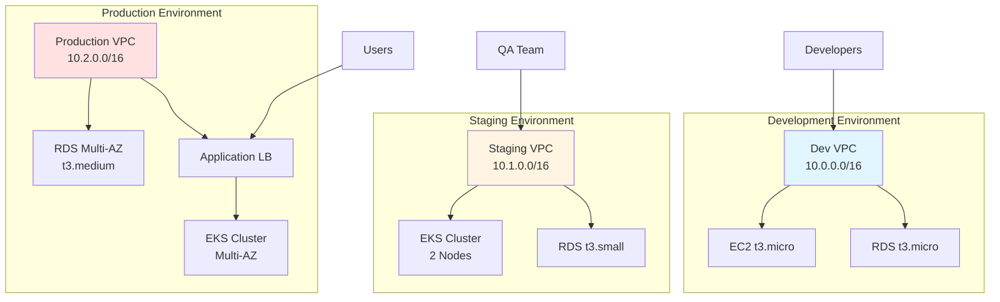

---

## Network Architecture

### Production VPC Architecture

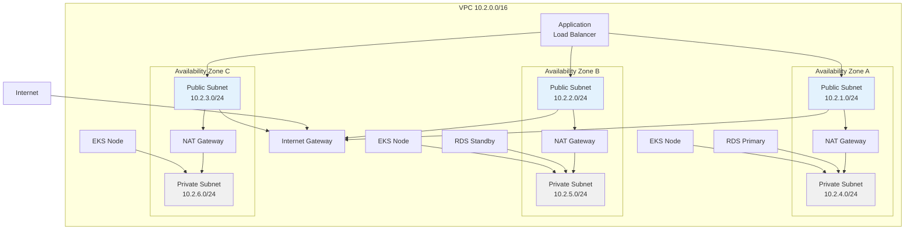

---

## Application Architecture

### Production Application Stack

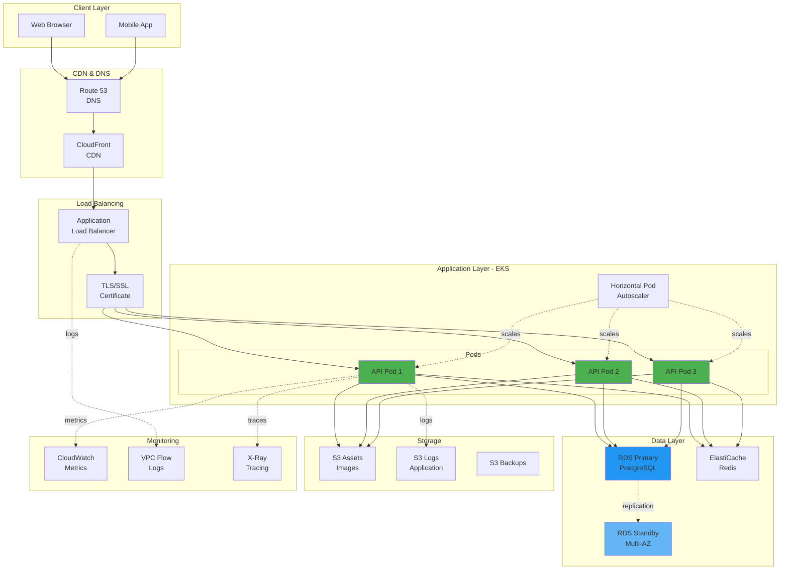

---

## Data Flow

### Request Flow

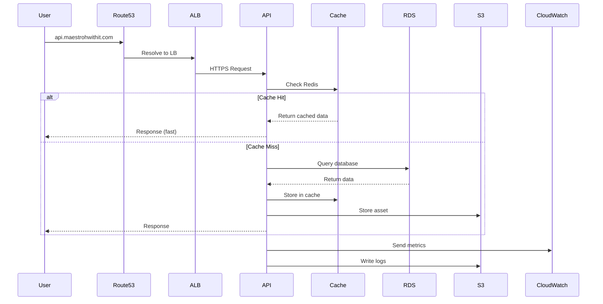

### Deployment Flow

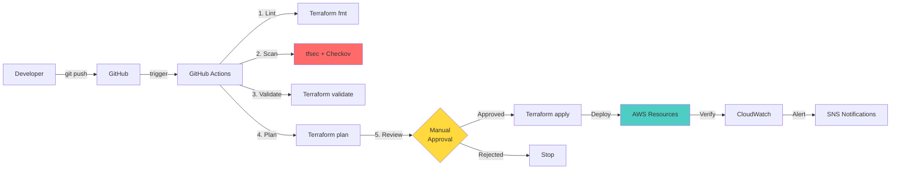

---

## Disaster Recovery

### Backup & Recovery Architecture

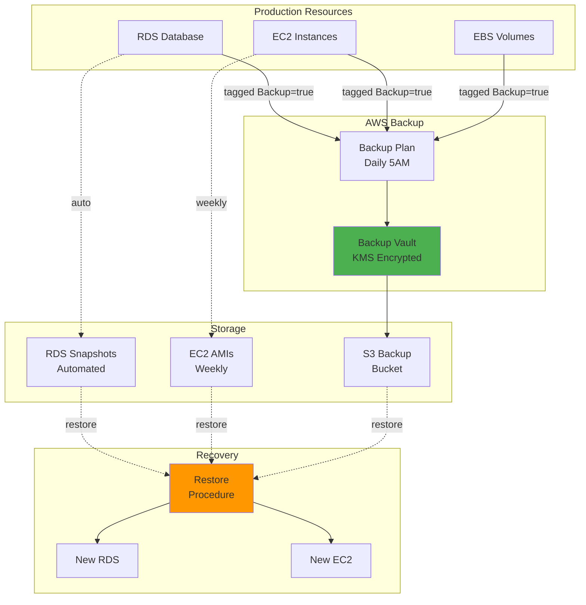

### Recovery Time Objectives

```mermaid
gantt
    title Disaster Recovery Timeline
    dateFormat  HH:mm
    axisFormat %H:%M
    
    section Detection
    Incident Detected           :a1, 00:00, 5m
    
    section Assessment
    Impact Assessment           :a2, after a1, 10m
    Decision to Restore         :a3, after a2, 5m
    
    section Recovery (RDS)
    Identify Snapshot           :b1, after a3, 5m
    Initiate Restore            :b2, after b1, 2m
    RDS Restore Process         :b3, after b2, 30m
    Update Endpoints            :b4, after b3, 5m
    Verification                :b5, after b4, 8m
    
    section Total
    RTO Target (1 hour)         :milestone, after b5, 0m
```

---

## CI/CD Pipeline

### Deployment Pipeline

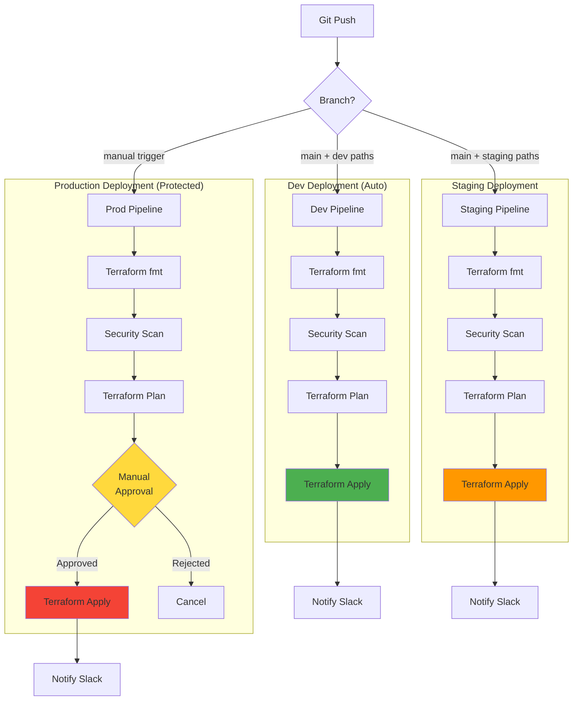

---

## Security Architecture

### Security Layers

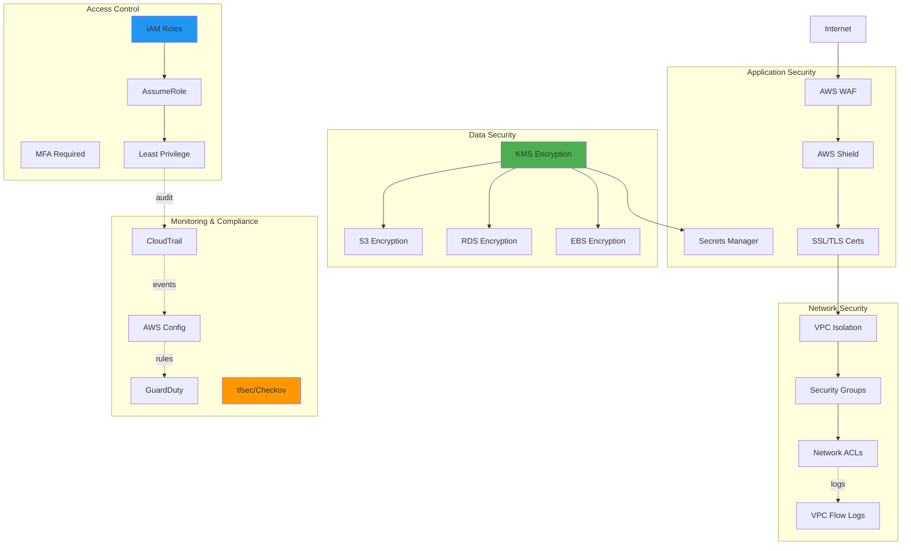

---

## Cost Optimization

### Cost by Environment

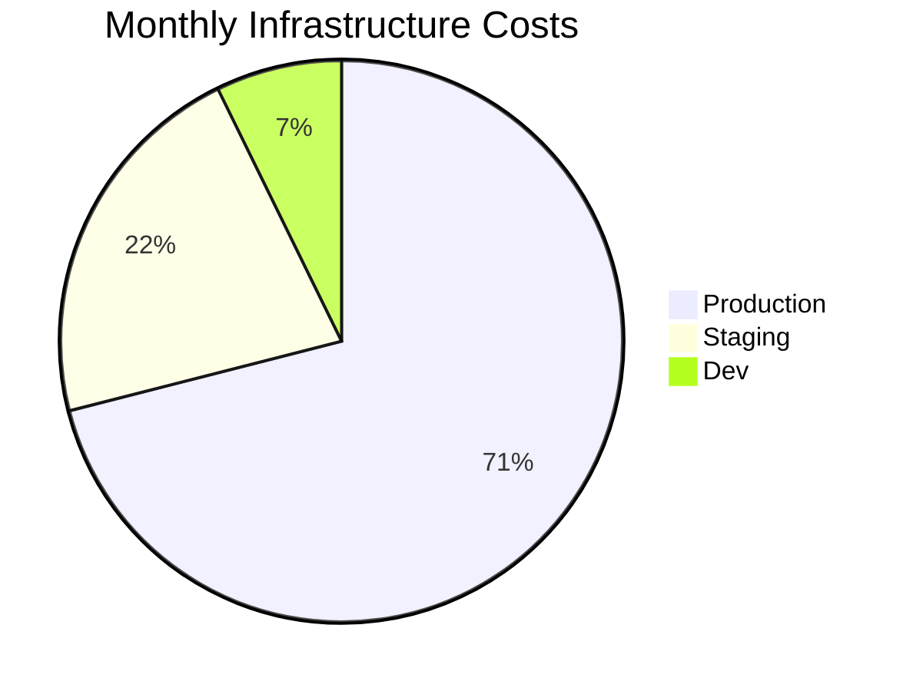

### Cost Breakdown (Production)

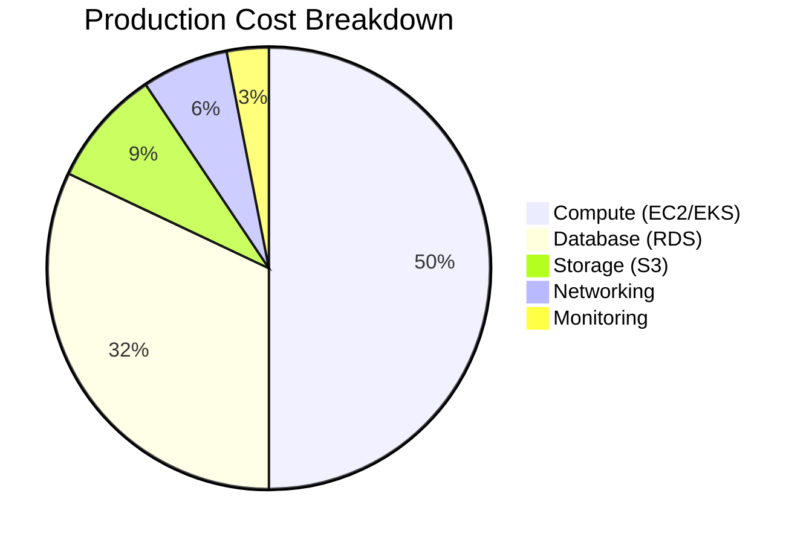

---

## Scaling Architecture

### Auto Scaling Flow

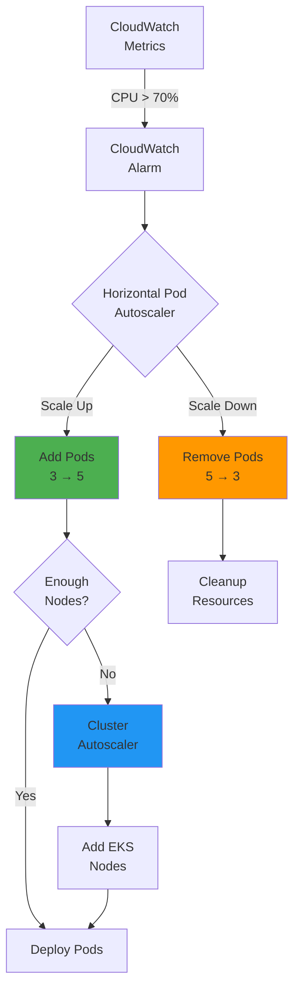

---

## Module Dependencies

### Terraform Module Graph

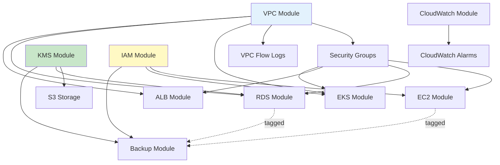

---

## Glossary

| Term | Description |
|------|-------------|
| **VPC** | Virtual Private Cloud - Isolated network |
| **AZ** | Availability Zone - Physical datacenter |
| **NAT** | Network Address Translation - Outbound internet |
| **IGW** | Internet Gateway - Inbound internet |
| **ALB** | Application Load Balancer - L7 load balancer |
| **EKS** | Elastic Kubernetes Service - Managed K8s |
| **RDS** | Relational Database Service - Managed DB |
| **Multi-AZ** | Multiple Availability Zones - HA setup |
| **HPA** | Horizontal Pod Autoscaler - K8s scaling |
| **RTO** | Recovery Time Objective - Max downtime |
| **RPO** | Recovery Point Objective - Max data loss |

---

**Architecture Documentation Version:** 1.0  
**Last Updated:** 2024-01-20  
**Maintained By:** DevOps Team
