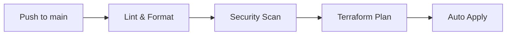
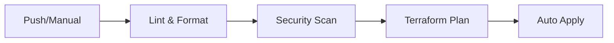
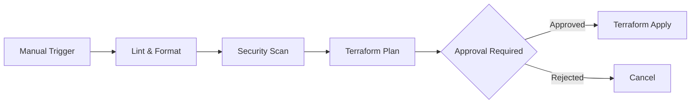

# Environment Management Guide

## Overview

The maestrohwithit infrastructure supports three environments: **Development (dev)**, **Staging**, and **Production (prod)**. Each environment is isolated with its own VPC, resources, and configurations.

## Environment Comparison

| Aspect | Dev | Staging | Production |
|--------|-----|---------|------------|
| **Purpose** | Development & testing | Pre-production testing | Live production |
| **VPC CIDR** | 10.0.0.0/16 | 10.1.0.0/16 | 10.2.0.0/16 |
| **Availability Zones** | 3 | 2 (cost optimization) | 3 (high availability) |
| **Instance Type** | t3.micro | t3.small | t3.medium |
| **Instance Count** | 1 | 1 | 2+ |
| **RDS Instance** | db.t3.micro | db.t3.small | db.t3.medium |
| **Multi-AZ RDS** | No | No | Yes |
| **Backup Retention** | None | 7 days | 30 days |
| **Auto Scaling** | No | Optional | Yes |
| **Monitoring Level** | Basic | Standard | Comprehensive |
| **Cost (Est/Month)** | $50-100 | $150-250 | $500-1000+ |

## Directory Structure

```
maestrohwithit-infra/
├── environments/
│   ├── dev/
│   │   ├── main.tf           # Dev infrastructure config
│   │   ├── variables.tf      # Variable definitions
│   │   ├── terraform.tfvars  # Dev-specific values
│   │   └── outputs.tf        # Output values
│   ├── staging/
│   │   ├── main.tf
│   │   ├── variables.tf
│   │   ├── terraform.tfvars
│   │   └── outputs.tf
│   └── prod/
│       ├── main.tf
│       ├── variables.tf
│       ├── terraform.tfvars
│       └── outputs.tf
└── modules/                  # Shared modules (used by all envs)
```

## Environment-Specific Configurations

### Development Environment

**Purpose:** Rapid development, testing new features, experimentation.

**Characteristics:**
- Minimal resources to reduce costs
- No backup requirements (can be recreated)
- Direct apply from CI/CD on main branch
- Loose security for easier debugging

**Access:**
```bash
cd environments/dev
terraform init
terraform plan -var-file=terraform.tfvars
terraform apply -var-file=terraform.tfvars
```

**Domain:** `*.maestrohwithit-dev.com`

**AWS Backend:**
```hcl
bucket = "maestrohwithit-infra-bucket"
key    = "maestrohwithit-backend/terraform.tfstate"
dynamodb_table = "maestrohwithit-backend-state-locks"
```

### Staging Environment

**Purpose:** Pre-production testing, QA, client demos, load testing.

**Characteristics:**
- Production-like but smaller/cheaper
- Limited backup retention (7 days)
- Deploy after dev validation
- 2 AZs for basic HA testing
- Manual or automated deployment

**Access:**
```bash
cd environments/staging
terraform init
terraform plan -var-file=terraform.tfvars
terraform apply -var-file=terraform.tfvars
```

**Domain:** `*.maestrohwithit-staging.com`

**AWS Backend:**
```hcl
bucket = "maestrohwithit-infra-bucket"
key    = "maestrohwithit-staging/terraform.tfstate"
dynamodb_table = "maestrohwithit-staging-state-locks"
```

### Production Environment

**Purpose:** Live customer-facing applications and services.

**Characteristics:**
- High availability (Multi-AZ)
- Comprehensive backups (30 days)
- Manual approval required for changes
- Enhanced monitoring and alerting
- Auto-scaling enabled
- Disaster recovery procedures

**Access:**
```bash
cd environments/prod
terraform init
terraform plan -var-file=terraform.tfvars
# Apply requires manual approval in GitHub Actions
```

**Domain:** `*.maestrohwithit.com`

**AWS Backend:**
```hcl
bucket = "maestrohwithit-infra-bucket"
key    = "maestrohwithit-prod/terraform.tfstate"
dynamodb_table = "maestrohwithit-prod-state-locks"
```

## Deployment Workflows

### Development Deployment

**Trigger:** Push to `main` branch affecting `environments/dev/`



**Workflow:** `.github/workflows/terraform.yaml`

### Staging Deployment

**Trigger:** Push to `main` branch affecting `environments/staging/` OR manual dispatch



**Workflow:** `.github/workflows/terraform-staging.yaml`

**Manual Deployment:**
1. Go to Actions tab in GitHub
2. Select "Terraform Staging Environment"
3. Click "Run workflow"
4. Choose branch (usually `main`)

### Production Deployment

**Trigger:** Manual workflow dispatch ONLY



**Workflow:** `.github/workflows/terraform-prod.yaml`

**Production Deployment Steps:**
1. **Plan First (Recommended):**
   - Actions → Terraform Production → Run workflow
   - Select `action: plan`
   - Review plan output in logs

2. **Apply Changes:**
   - Actions → Terraform Production → Run workflow
   - Select `action: apply`
   - Requires designated reviewer approval
   - Monitor apply progress

## Managing Terraform State

Each environment has its own isolated Terraform state in S3.

### Viewing State

```bash
# List all resources in state
cd environments/prod
terraform state list

# Show specific resource
terraform state show module.vpc.aws_vpc.main
```

### Remote State Data Sources

To reference outputs from one environment in another:

```hcl
# In staging, reference dev VPC
data "terraform_remote_state" "dev" {
  backend = "s3"
  config = {
    bucket = "maestrohwithit-infra-bucket"
    key    = "maestrohwithit-backend/terraform.tfstate"
    region = "us-east-2"
  }
}

# Use dev VPC CIDR for peering
resource "aws_vpc_peering_connection" "staging_to_dev" {
  vpc_id      = module.vpc.vpc_id
  peer_vpc_id = data.terraform_remote_state.dev.outputs.vpc_id
}
```

## Environment Promotion Flow

```
Developer → Dev → Staging → Production
```

### Typical Promotion Process:

1. **Develop in Dev:**
   ```bash
   # Make infrastructure changes
   cd environments/dev
   terraform apply
   # Test thoroughly
   ```

2. **Promote to Staging:**
   ```bash
   # Copy changes to staging config
   cd environments/staging
   # Update terraform.tfvars if needed
   terraform plan  # Review changes
   terraform apply
   # Full QA testing
   ```

3. **Promote to Production:**
   ```bash
   cd environments/prod
   # Update terraform.tfvars carefully
   terraform plan -out=prod.plan
   # Review plan extensively
   # Get team approval
   terraform apply prod.plan
   # Monitor closely
   ```

## Resource Tagging Strategy

All resources are tagged with:

```hcl
tags = {
  Environment = "dev|staging|prod"
  Application = "maestrohwithit"
  ManagedBy   = "Terraform"
  Owner       = "DevOps Team"
  CostCenter  = "Engineering"
  Backup      = "true|false"  # For AWS Backup selection
}
```

### Filtering Resources by Environment

```bash
# List all EC2 instances in production
aws ec2 describe-instances \
  --filters "Name=tag:Environment,Values=prod" \
  --query 'Reservations[*].Instances[*].[InstanceId,Tags[?Key==`Name`].Value|[0]]' \
  --output table

# Calculate costs by environment
aws ce get-cost-and-usage \
  --time-period Start=2024-01-01,End=2024-01-31 \
  --granularity MONTHLY \
  --metrics BlendedCost \
  --group-by Type=TAG,Key=Environment
```

## Access Control

### IAM Roles by Environment

| Role | Dev | Staging | Prod |
|------|-----|---------|------|
| Developer | Full access | Read-only | No access |
| DevOps | Full access | Full access | Limited (no delete) |
| Admin | Full access | Full access | Full access |
| CI/CD | Apply | Apply | Plan only* |

*Production applies require manual approval

### Setting Up Environment-Specific AWS Profiles

```bash
# ~/.aws/config
[profile maestrohwithit-dev]
region = us-east-2
role_arn = arn:aws:iam::123456789012:role/maestrohwithitDeveloper
source_profile = default

[profile maestrohwithit-staging]
region = us-east-2
role_arn = arn:aws:iam::123456789012:role/maestrohwithitStaging
source_profile = default

[profile maestrohwithit-prod]
region = us-east-2
role_arn = arn:aws:iam::123456789012:role/maestrohwithitProduction
source_profile = default
mfa_serial = arn:aws:iam::123456789012:mfa/your-user
```

Usage:
```bash
export AWS_PROFILE=maestrohwithit-prod
terraform plan
```

## Cost Management

### Monitoring Costs

```bash
# Get current month costs by environment
aws ce get-cost-and-usage \
  --time-period Start=$(date +%Y-%m-01),End=$(date +%Y-%m-%d) \
  --granularity MONTHLY \
  --metrics UnblendedCost \
  --group-by Type=TAG,Key=Environment \
  --filter file://environment-filter.json
```

### Cost Optimization Tips

**Dev Environment:**
- Stop EC2 instances after hours
- Use smaller instance types
- No Multi-AZ for RDS
- Shorter backup retention

**Staging:**
- Scale down on weekends
- Use spot instances where possible
- 7-day backup retention

**Production:**
- Use Reserved Instances for base load
- Auto-scaling for dynamic load
- Rightsizing based on CloudWatch metrics

### Automated Cost Alerts

Set up AWS Budgets for each environment:

```bash
aws budgets create-budget \
  --account-id 123456789012 \
  --budget file://dev-budget.json \
  --notifications-with-subscribers file://dev-notification.json
```

## Troubleshooting

### Common Issues

#### 1. State Lock Conflicts

```bash
# If state is locked
terraform force-unlock <lock-id>
```

#### 2. Environment Mismatch

Always verify you're in the correct directory:
```bash
pwd  # Should show /environments/{env}
grep 'environment' terraform.tfvars  # Verify environment value
```

#### 3. Resource Name Conflicts

Each environment uses prefixes:
- Dev: `dev-maestrohwithit-*`
- Staging: `staging-maestrohwithit-*`
- Prod: `prod-maestrohwithit-*`

## Best Practices

1. **Never modify production directly** - Always test in dev/staging first
2. **Use consistent variables** - Keep variable names same across environments
3. **Document changes** - Update this guide when adding new environments
4. **Review plans carefully** - Especially for production
5. **Backup before major changes** - Create manual snapshots
6. **Monitor after deployment** - Watch CloudWatch for 30 minutes post-deploy
7. **Use workspaces carefully** - We use separate directories, not workspaces

## Emergency Procedures

### Rollback Infrastructure Changes

```bash
# View state history
terraform state list

# Rollback using state file version
aws s3 cp s3://maestrohwithit-infra-bucket/maestrohwithit-prod/terraform.tfstate.backup \
  s3://maestrohwithit-infra-bucket/maestrohwithit-prod/terraform.tfstate

# Or use Terraform to revert specific resource
terraform import module.vpc.aws_vpc.main vpc-12345678
```

### Environment Isolation Breach

If resources from different environments are communicating:

1. Check security groups
2. Verify CIDR ranges don't overlap
3. Review VPC peering connections
4. Check Route53 records

## Useful Commands

```bash
# Quick environment status
cd environments/prod && terraform show

# Compare environments
diff environments/dev/terraform.tfvars environments/prod/terraform.tfvars

# Export environment outputs
terraform output -json > outputs.json

# Validate all environments
for env in dev staging prod; do
  cd environments/$env
  terraform validate
  cd ../..
done
```
